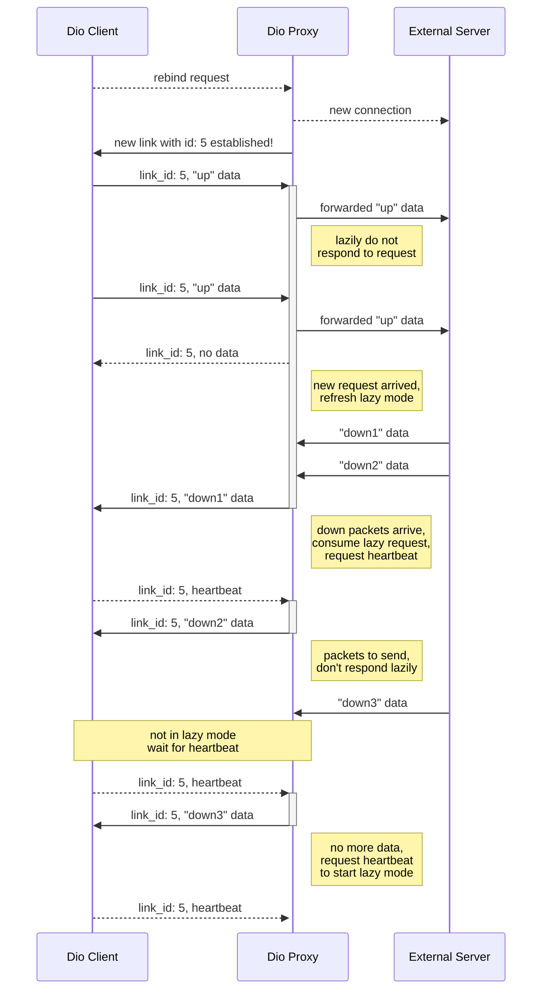

# Btr

`btr` (by-the-rules) is a *semi-small* collection of utilities which are designed to help with restricted internet access using different methods of proxying traffic for specific ports.

This project started as a small experiment of how far can you get in sneaking around firewall and http based filters **without** gaining any extra privileges and breaking any usage guidelines.

> Contrary to the name, usage of this project *could* break institution internet usage guidelines, be sensible.

## Usage

`btr` supports multiple modes of operation:
- `btr` tunnels
- `dio` tunnels
- `route-chrome` helper

`btr` supported modes change almost every version and this README only contains the basic usage, so it's best to check its help page using `./btr3.py -h`

---

### `btr` tunnels

`btr` tunnels are are a tcp only proxy-like service. Currently there are two types of `btr` tunnels: `open-tun` and `direct-tun`.

`direct` tunnel is the simplest type of a proxy there is, it just proxies your tcp connections from `localhost` to your `relay` address. The following command proxies `localhost` ports `48022` and `48443` to `my_relay.net` ports `22` and `48443`
```sh
./btr3.py direct-tun my_relay.net -t 48022:22 -t 48443
```

`open` tunnel is the same as a `direct` proxy but it connects to your `relay` using an http proxy
```sh
./btr3.py open-tun my_relay.net --proxy proxy.local -t 48022:22 -t 48443
```

---

### `btr dio` tunnels

`dio` tunnels are a more powerful tunneling method by emulating a pseudo-network layer protocol over other application protocols. Currently two types of `dio` tunnels are supported: `dio-raw-tun` and `dio-ns-tun`. Both function the same, only changing the transport method used.

`dio` tunnels need a `dio` server listening on the other side, which is started using `dio-serve`. (which listens for all types of `dio` tunnels) `dio` also needs a certificate + private key combo due to using the quic protocol, these can be self-signed and `btr` clients will trust them automatically.
```sh
./btr3.py dio-serve 0.0.0.0:48001 --cert my_cert.pem --priv my_key.pem --pass my_key_pass
```

`dio` tunnels can then be started using eg. `dio-raw-tun`. To proxy udp port `48089` and tcp port `48090`
```sh
./btr3.py dio-raw-tun my_relay.net:48001 --cert my_cert.pem -u 48089 -t 48090
```

---
### chrome router

The `route-chrome` mode is just a helper which launched a `chrome(ium)` session with launch flags that redirect all traffic to a `socks` proxy. 

> [!warning]
> all chrome windows must be closed for this to work, as chrome [ignores](https://stackoverflow.com/questions/56226698/chrome-command-line-flags-do-nothing) launch flags otherwise

```sh
./btr3.py route-chrome localhost:1080
```

## Technical Overview

This projects goal was to create the most capable proxying service which didn't require any superuser privileges and used as little external dependencies as possible.

`btr` itself is a python script with most heavy lifting being done by the python standard library of modules.

### `btr` tunnels

These under the hood are simple tcp proxies implemented using the `socket` and `selector` modules. `btr` in this mode creates tcp sockets which listen on the requested ports on `localhost` and forward all data to a "worker" socket which is created using the `btr` tunnel mode. (`direct` or `open`) 

This more also supports "connection pooling" which could be used to open sockets while possible and *store* them until required, this however didn't fully work as no protocol agnostic way to send *keep alive* packets exists + worker socket reuse could be only done when using a limited number of protocols (eg. `http` but not `ssh`)

This method was fully implemented only using the standard modules and doesn't require any external deps

### `dio` protocol

> TL;DR: `dio` is a request based pseudo-[network layer](https://en.wikipedia.org/wiki/OSI_model#Layer_architecture) protocol designed to be transferred over a different application layer protocol

`dio` or (Dns Input Output) is the result of a attempt at a minimal [Dns Tunneling Proxy](https://www.catchpoint.com/network-admin-guide/dns-tunneling). While dns tunneling is often used with malicious intents, it's just another way to transfer data to a remote server *unrestricted*, which can be used by a proxy. 

`dio` itself is a protocol for communicating with a remote server over a udp-like transfer method with no established "connections", it has been designed with dns in focus but it could be easily adapted for any request based protocol which can transfer at least a few bytes per request/response.

When a `dio` client wants to proxy udp like traffic, it requests a `dio link`. `links` are the stand-in for ports and ip addresses in `dio` and are the way servers distinguish clients from one another. `links` provide a unreliable way to proxy udp traffic by sending *up* packets in requests and receiving *down* packets in responses, light packet fragmentation is also supported.

New `links` are communicated using `dio rebind` requests which are the only `dio` specific packets that don't transfer traffic. 
These `links` are then closed after a timeout of no traffic coming trough the `link`. (by default 60 seconds)
> [!note]
> Because of the internal layout of `dio`, only 63 simultaneous `links` are supported per server

Because `dio` is a request based protocol, only the client can send packets at any time, server on the other hand has to wait for a request before it can start sending *down* packets to the client. For that reason the client periodically send *heartbeats* if no *up* packets are buffered so any *down* packets buffered on the server can start being transferred.

For the same reason and to allow for bigger pauses between *heartbeats*, `dio` adapts lazy requests inspired by the [iodine](https://github.com/yarrick/iodine) proxy. When operating using lazy requests, the server does **not** respond to a request immediately instead preferring to always keep one request in its awaiting state so it can respond immediately when new *down* packets arrive, avoiding the need to wait for a *heartbeat* request.

Here's a diagram of a client and a server proxying a `link` with lazy requests


`dio` also support for transferring tcp traffic over a quic connection (which is it self transferred over a `dio link`) `btr` includes a built-in quic server which is used for quic streams a is also the only external dependency requiring the `aioquic` module. 

This protocol is then wrapped in another request based protocol of your choosing as described above.
